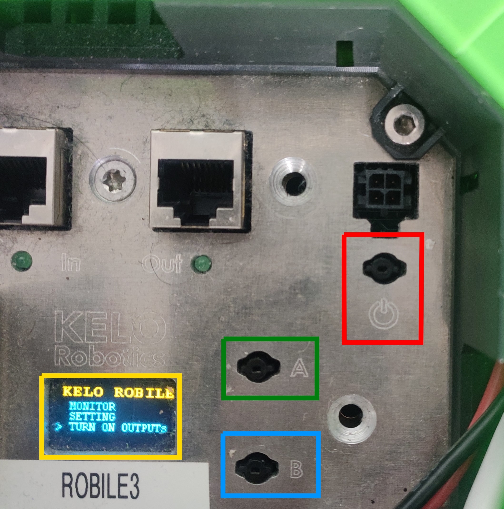

.. _robile_switch_on:

Switching-on the Robot
======================

The Robile robot is switched on by pressing the power button (in red colored box) on the robot. 
The robot will start up and the LED will turn green. The Robile bricks are now supplied with power. 
To start the CPU, scroll to the **input power on** option by using the button B (in blue colored box) 
and select it by pressing the button A (in green colored box), which sometimes requires long press. 
The robot is now ready to be used.

To switch off the robot, select the **switch off output** option. 
To completely switch off the power supply to the robot, long press the power button on the robot.

.. note::
    The battery percentage can be checked by selecting the **monitor** option.