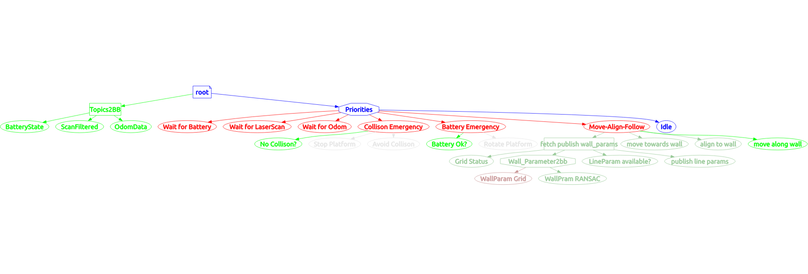

# robile_behaviors

## Overview

Different behaviors of Robile using `py_trees` are implemented in this package.

## Structure

```
robile_behaviors
|    CMakeLists.txt
|    package.xml
|    setup.py
|    README.md
|____ros
     |____launch
     |    |_____wall_following.launch
     |    |
     |____scripts
     |    |_____behavior_tree
     |                      |     __init__.py
     |                      |     behaviors.py 
     |                      |_____utils.py 
     |____src
          |    battery_voltage_publisher
          |    wall_following
          |____marker_line
```

## Description

### `wall_following` behavior



1. `wall_following` node consists of structuring of behavior tree using the behaviors imported from `behaviors.py`

2. `marker_line` node helps to visualize the extracted lines in `rviz` and the `battery_voltage_publisher` node initialises the `mileage` topic over which the battery voltage can be published.


## Instructions to run scripts:

1. Refer to the `getting stared` section from the [documentation](https://robile-amr.readthedocs.io/en/latest/getting_started.html) and the instructions from the [assignmnet file](https://github.com/HBRS-AMR/WS22_Assignment_BehaviorTree), for the initial setup of the repository (if not completed already).

2. If initial setup was already completed, pull from the `main` branch to get the `robile_behavior` package. Build the package and source the `setup.bash` from catkin workspace.

3. To run the `wall_following` behavior in simuation, run the following command, and publish the battery voltage to the `mileage` topic 
    ```
    roslaunch robile_behaviors wall_following.launch  
    rostopic pub /mileage std_msgs/Float32 "data: 50.0" -r10
    ```

4. `rviz` will open automatically, and once it is open select the dropdown `File`, select `Open Config`. Locate `robile_wall_following.rviz` from the `Robile/robile_gazebo/config/rviz/` path and click on the `close wihtout saving` button in the pop-up.

5. To visualise the behavior tree and the blackboard, please run the following command in new terminal:
    ```
    rqt_py_trees
    py-trees-tree-watcher  
    py-trees-blackboard-watcher
    ```