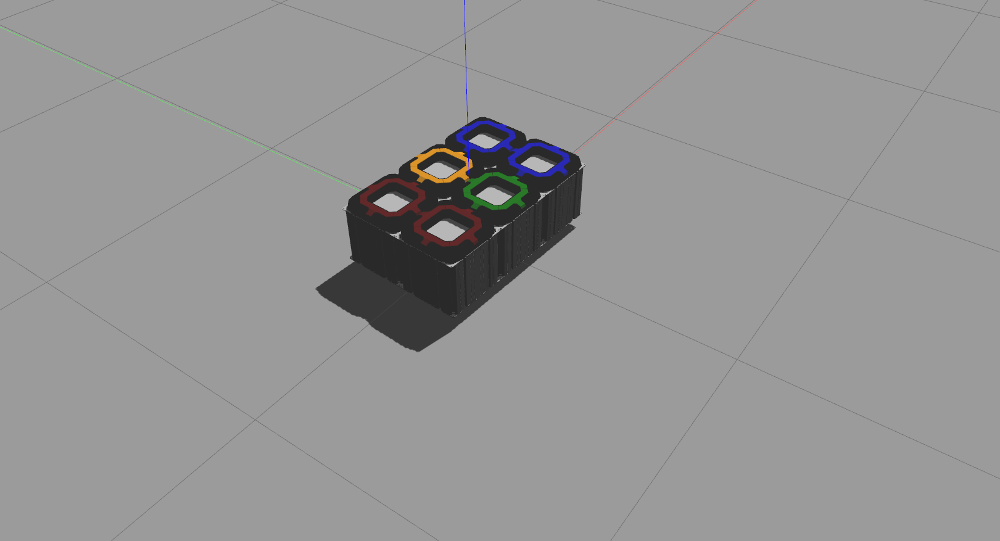

# robile_gazebo

Gazebo simulations for KELO ROBILE robots

## Installation
In addition to a few ROS dependencies, this package also depends on the following packages provided by KELO-robotics:
1. [kelo_tulip](https://github.com/kelo-robotics/kelo_tulip)
2. [robile_description](https://github.com/kelo-robotics/robile_description)

Assuming you have a catkin workspace at `~/catkin_ws` and `kelo_tulip` repository, execute the below commands to install the simulator and its dependencies

~~~ sh
sudo apt install ros-$ROS_DISTRO-controller-manager ros-$ROS_DISTRO-effort-controllers ros-$ROS_DISTRO-velocity-controllers ros-$ROS_DISTRO-joint-state-controller ros-$ROS_DISTRO-gazebo-ros ros-$ROS_DISTRO-gazebo-ros-control

cd ~/catkin_ws/src
git clone https://github.com/kelo-robotics/robile_description.git

catkin build kelo_tulip

catkin build robile_description robile_gazebo
source ~/catkin_ws/devel/setup.bash
~~~

## Usage

To start the gazebo simulator, use one of the launch files defined in the [launch/](launch/) directory as follows:

~~~ sh
roslaunch robile_gazebo 4_wheel_platform.launch
~~~

You can then publish command velocities on the ros topic `/cmd_vel` to move the robot around. For example, to move the robot forward with 0.5 m/s velocity, execute the below command in a new terminal:

~~~ sh
rostopic pub /cmd_vel geometry_msgs/Twist "linear:
  x: 0.5
  y: 0.0
  z: 0.0
angular:
  x: 0.0
  y: 0.0
  z: 0.0" -r 10
~~~

### Disabling kelo_tulip platform controller

The `kelo_tulip` platform controller requires information about every continuous (or movable) joint in all the connected KELO Drives. Moreover, it sends control data for every hub wheel. This can potentially increase the simulation load on weaker computers. If the goal of simulation is to move the robot around without worrying about the platform controller used, then `kelo_tulip` can be switched off and the more simpler [gazebo_ros_planar_move](https://classic.gazebosim.org/tutorials?tut=ros_gzplugins#PlanarMovePlugin) platform controller can be used. To start the simulation with the `gazebo_ros_planar_move` instead of `kelo_tulip` use the below command:

~~~ sh
roslaunch robile_gazebo 4_wheel_platform.launch use_kelo_tulip:=false
~~~

### Moving the robot using a keyboard

The [teleop_twist_keyboard](http://wiki.ros.org/teleop_twist_keyboard) ROS package can be used to simplify controlling the motion of the robot. This requires a one time installation of the `teleop_twist_keyboard` package using the below command:

~~~ sh
sudo apt install ros-$ROS_DISTRO-teleop-twist-keyboard
source /opt/ros/$ROS_DISTRO/setup.bash
~~~

Then start the `teleop_twist_keyboard.py` node using the command `rosrun teleop_twist_keyboard teleop_twist_keyboard.py` and move the robot as per the instructions displayed on the terminal. Below is an example of the output after running the node:

~~~
rosrun teleop_twist_keyboard teleop_twist_keyboard.py 

Reading from the keyboard  and Publishing to Twist!
---------------------------
Moving around:
   u    i    o
   j    k    l
   m    ,    .

For Holonomic mode (strafing), hold down the shift key:
---------------------------
   U    I    O
   J    K    L
   M    <    >

t : up (+z)
b : down (-z)

anything else : stop

q/z : increase/decrease max speeds by 10%
w/x : increase/decrease only linear speed by 10%
e/c : increase/decrease only angular speed by 10%

CTRL-C to quit

currently:	speed 0.5	turn 1.0 
~~~

### Additional launch file arguments

Several arguments can be passed when launching the simulator. A complete list of supported roslaunch arguments can be found in the [launch/platform_independent/robile_gazebo.launch](launch/platform_independent/robile_gazebo.launch) file. We list a few most important ones here.

| Argument name        | Type    | Default | Description                                                                   |
|----------------------|---------|---------|-------------------------------------------------------------------------------|
| platform_max_lin_vel | float   | 1.0     | Maximum linear velocity the platform can achieve in the XY plane (in m/s)     |
| platform_max_ang_vel | float   | 1.0     | Maximum angular velocity the platform can achieve along the Z axis (in rad/s) |
| init_pos_x           | float   | 0.0     | Spawn position of robot along the world X-axis                                |
| init_pos_y           | float   | 0.0     | Spawn position of robot along the world Y-axis                                |
| init_yaw             | float   | 0.0     | Spawn orientation of robot along the world Z-axis                             |
| gazebo_gui           | boolean | true    | Start the Gazebo simulation GUI                                               |
| start_rviz           | boolean | true    | Start RViz with a predefined RViz configuration file                          |

For example to change the spawn position of the robot to `(2.0, 3.0)`, and disable the Gazebo GUI, use the below command:

~~~ sh
roslaunch robile_gazebo 4_wheel_platform.launch init_pos_x:=2.0 init_pos_y:=3.0 gazebo_gui:=false
~~~

## TUTORIAL: Adding a custom ROBILE platform

In this section we describe the procedure to simulate custom ROBILE platform configurations.

### Step-1: Add a new ROBILE platform definition

Simulating a custom platform, requires defining the robot configuration in a URDF file. This must be done in the [robile_description](https://github.com/kelo-robotics/robile_description) package and detailed instructions for the same are available [here](https://github.com/kelo-robotics/robile_description#tutorial-building-a-custom-robile-platform-configuration).

### Step-2: Define ros-control configuration file for the custom platform

Lets assume our custom platform config is called `simple_config` (continuing from the [robile_description tutorial](https://github.com/kelo-robotics/robile_description#tutorial-building-a-custom-robile-platform-configuration)). Follow the below steps to add ros-controllers for the custom platform.

1. Add a new file called `simple_config.yaml` in the directory [config/ros_controller/](config/ros_controller/). **This file name must match the name of the platform defined in the robile_description package.**
2. Add the following block of code to the file to create a [joint_state_controller](http://wiki.ros.org/ros_control#Controllers).
    ~~~ yaml
    # Publish all joint states -----------------------------------
    joint_state_controller:
        type: joint_state_controller/JointStateController
        publish_rate: 50

    # Velocity Controllers -----------------------------------------
    ~~~
3. For every `robile_active_wheel` module defined in the platform configuration file `robile_description/robots/simple_config.urdf.xacro`, include the below block of code in the YAML file. Replace the `<ROBILE_MODULE_NAME>` with the actual name defined for the ROBILE module in the URDF file.
    ~~~ yaml
    <ROBILE_MODULE_NAME>_left_hub_wheel_controller:
        type: effort_controllers/JointVelocityController
        joint: <ROBILE_MODULE_NAME>_drive_left_hub_wheel_joint
        pid: {p: 100.0, i: 10.0, d: 0.01}
    <ROBILE_MODULE_NAME>_right_hub_wheel_controller:
        type: effort_controllers/JointVelocityController
        joint: <ROBILE_MODULE_NAME>_drive_right_hub_wheel_joint
        pid: {p: 100.0, i: 10.0, d: 0.01}
    ~~~
4. A complete `config/ros_controller/simple_config.yaml` should look something like the one shown below:
    ~~~ yaml
    # Publish all joint states -----------------------------------
    joint_state_controller:
        type: joint_state_controller/JointStateController
        publish_rate: 50

    # Velocity Controllers -----------------------------------------
    robile_3_left_hub_wheel_controller:
        type: effort_controllers/JointVelocityController
        joint: robile_3_drive_left_hub_wheel_joint
        pid: {p: 100.0, i: 10.0, d: 0.01}
    robile_3_right_hub_wheel_controller:
        type: effort_controllers/JointVelocityController
        joint: robile_3_drive_right_hub_wheel_joint
        pid: {p: 100.0, i: 10.0, d: 0.01}

    robile_4_left_hub_wheel_controller:
        type: effort_controllers/JointVelocityController
        joint: robile_4_drive_left_hub_wheel_joint
        pid: {p: 100.0, i: 10.0, d: 0.01}
    robile_4_right_hub_wheel_controller:
        type: effort_controllers/JointVelocityController
        joint: robile_4_drive_right_hub_wheel_joint
        pid: {p: 100.0, i: 10.0, d: 0.01}
    ~~~

### Step-3: Define a ros launch file for the custom platform

A platform specific launch file can be defined as follows:

1. Add a new launch file called `simple_config.launch` in the [launch/](launch/) directory.
2. Add the following code block to the launch file:
    ~~~ xml
    <?xml version="1.0"?>
    <launch>
        <!--
            Platform specific arguments must be defined here
        -->
        
        <include file="$(find robile_gazebo)/launch/platform_independent/robile_gazebo.launch" pass_all_args="true"/>
    </launch>

    ~~~
3. Add an argument to specify the name of the platform configuration file. The name must exactly match the platform config URDF file name which is defined in the ` robile_description/robots/` directory. In our example this would be `simple_config`.
    ~~~ xml
    <arg name="platform_config" value="simple_config"/>
    ~~~
4. Add an argument to specify if `kelo_tulip` must be used as the platform controller by default. If this is set to false, all the wheel and pivot joints will be treated as fixed and the `gazebo_ros_planar_move` plugin will be used as the platform controller.
    ~~~ xml
    <arg name="use_kelo_tulip" default="true"/>
    ~~~
5. Finally list all the hub wheel controller names defined in the `config/ros_controller/simple_config.yaml` file as follows:
    ~~~ xml
    <arg name="hub_wheel_controller_list" 
         value="robile_3_left_hub_wheel_controller
                robile_3_right_hub_wheel_controller
                robile_4_left_hub_wheel_controller
                robile_4_right_hub_wheel_controller" />
    ~~~
6. The complete ros launch file should look something like the one shown below:
    ~~~ xml
    <?xml version="1.0"?>
    <launch>
        <!--
            Platform specific arguments must be defined here
        -->
        <arg name="platform_config" value="simple_config"/>
        <arg name="use_kelo_tulip" default="true"/>
        <arg name="hub_wheel_controller_list" 
             value="robile_3_left_hub_wheel_controller
                    robile_3_right_hub_wheel_controller
                    robile_4_left_hub_wheel_controller
                    robile_4_right_hub_wheel_controller" />

        <include file="$(find robile_gazebo)/launch/platform_independent/robile_gazebo.launch" pass_all_args="true"/>
    </launch>
    ~~~
