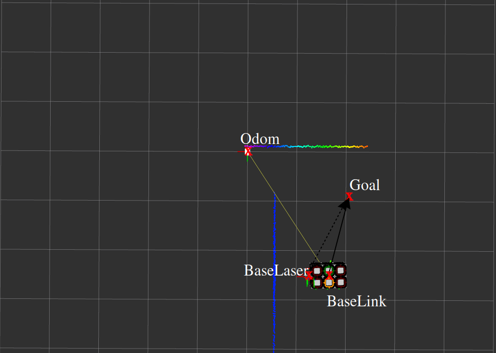
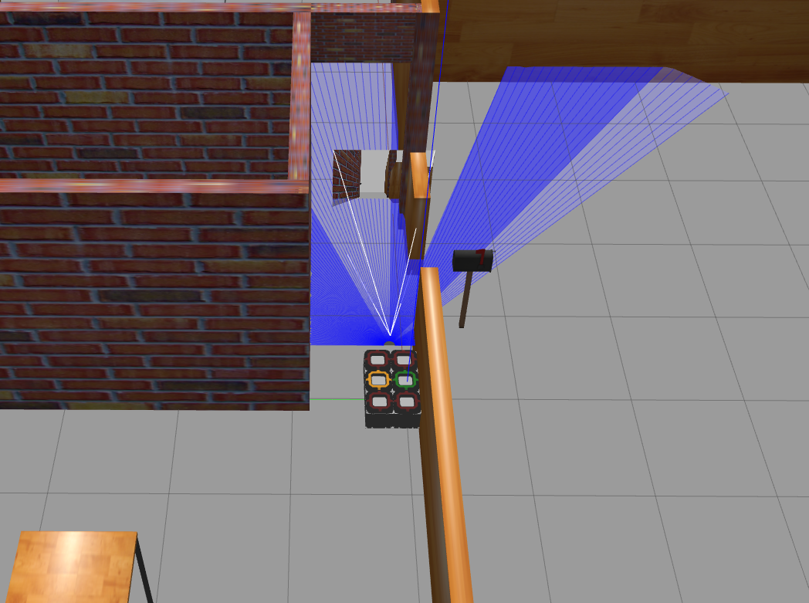

Worksheet 01: ROS2 Nodes, Topics, Frames (TF) and URDF
====================================

System Setup:
-------------
* The instructions to set-up the system can be found [here](https://robile-amr.readthedocs.io/en/rolling/getting_started.html)

* Please make sure the version of the documentation is "rolling". It can be found in the left bottom corner of the documentation page. If any issue is found while setting up the system, please reach out via AMR forum (lea).

Recap of Running the Simulation:
-------------------------------
> Note:  
      - Make sure to source the `/opt/ros/rolling/setup.bash` in every new terminal.
      - Buid all the packages as mentioned in the `Getting Started` section of the documentation above.
      - Verify if the branch is set to `rolling` in all the repositories. If not, please switch to `rolling` branch. The branch can be switched by running `git checkout rolling` command in the repository directory.
      - Please deactivate `conda` environment if it is activated. The `conda` environment can be deactivated by running `conda deactivate` command in the terminal. To do this globally, set the conda configuration by running `conda config --set auto_activate_base false` command in the terminal. This will deactivate the `conda` environment by default.

### Running Robile Platform in Simulation:

* The simulation can be launched by running the following command in the terminal:
```bash 
ros2 launch robile_gazebo gazebo_4_wheel.launch.py
```
* In the rviz, select the configuration from the File->Open Config menu. The configuration file can be found in the `robile_gazebo/config/rviz/robile_rolling.rviz` path.

* In the gazebo, if the platform is not spawned, please stop the simulation by `Ctrl+C` and launch the simulation again. (Please do not use `Ctrl+Z` to stop the simulation. It will not kill the script but will put it in the background.)

* If the launch file stops by itself or even after pressing `Ctrl+C`, please verify if any process named `gzclient` is running. If it exists, then kill the process by using the PID associated with the process. In the below command, replace the `<PID>` with the PID of the process. The PID can be found by running `ps` command in the terminal:
```bash
ps
kill -9 <PID>
```

* Great job! You have successfully launched the simulation. Now, let's move on to the exercises.
* If you are facing any issues, please post your queries in AMR forum (lea)

Exercise-01: Move the Robile Platform in Simulation
----------------------------------------------------

> Objective: to understand the basic structure of ROS2 nodes, topics and messages.

Overview: Send velocity commands to the robile platform to move in a particular pattern. The velocity commands can be sent to the `\cmd_vel` topic. This topic accepts `geometry_msgs/msg/Twist` messages. The `geometry_msgs/msg/Twist` message has two fields `linear` and `angular`. The `linear` field is of type `geometry_msgs/msg/Vector3` and `angular` field is of type `geometry_msgs/msg/Vector3`. The `geometry_msgs/msg/Vector3` message has three fields `x`, `y` and `z`. The `x` and `y` fields in `linear` field are used to specify the linear velocity in x and y directions respectively. The `z` field in `angular` field is used to specify the angular velocity about z-axis. The `geometry_msgs/msg/Twist` message definition can be found [here](https://docs.ros2.org/foxy/api/geometry_msgs/msg/Twist.html)

### Move in Circle:

* Move the robile platform in a circular pattern. Write your implementation in the `robile_control_simple` package placed under `Robile/robile_demos/` path to send velocity commands to the robile platform. 
* Build the package from your workspace in a new terminal. Before building, please source the setup.bash file of ROS as described in the `Getting Started` section of the documentation. After building, source the local_setup.bash file (`source ~/WS_Name/install/local_setup.bash`). 
* Run the `robile_control_simple` node to move the platform in a circular pattern. Make sure the simulation is launched and rviz is running and the rviz configuration file is selected (`robile_gazebo/config/rviz/robile_rolling.rviz`):

```bash
ros2 run robile_control_simple circular_motion_publisher
```

### Move in square:

* Once the platform is successfully moving in a circular pattern, create your own node by following the tutorial from [here](https://docs.ros.org/en/rolling/Tutorials/Beginner-Client-Libraries/Writing-A-Simple-Py-Publisher-And-Subscriber.html). Setup the package.xml, setup.py and your node file similar to the `robile_control_simple` node. 
* Make the robot move a square pattern instead of the circular pattern. Please feel free to use additional python libraries if required.


Exercise-02: Move the Robile Platform to a Goal
------------------------------------------------

> Objective: to understand different available frames in the system and to transform the goal position from one frame to another.

Overview: The robot is associated with different frames which simplify the task of specifying tasks with different scopes. In the simulation, different frames can be viewed under the `tf` section in rviz. The most frequently used frames are `odom`, `base_link` and `base_laser`. When the robot driver is started, the location of the robot will be fixed as `odom` frame. The `base_link` of the robot is assigned to the centroid of the robot measured in the 2D-plane. The `base_laser` frame is assigned to the laser sensor of the robot. When the robot driver is started, both `odom` and `base_link` will be overlapping. Generally, the `odom` frame will be considered as a fixed frame and `base_link` will be used to provide velocity commands. The environment will be perceived with respect to the `base_laser` frame. This can be transformed to the `base_link` to decide the direction of motion and it can be transformed to the `odom` frame to get the global position of the goals or obstacles. This allows continuously updating velocity commands based on the perception data at the first instance and allows planning the path or the direction without active perception.

### Move to a goal:

<p align="center">

</p>

* Consider a situation where the robot has to reach a particular location where it has perceived an object with respect to the `base_laser` frame and it has to move to that location (goal). 
* The robot has to decide in which direction it has to move to reach the goal location. It should also monitor if it has reached the goal location.
* To solve this, goal location can be transformed with respect to the `base_link` frame and also with respect to the `odom` frame (as they might not be overlapping if the robot has already moved after starting its drivers). 
* The transformed goal with respect to the `base_link` can be used to decide the direction for `cmd_vel` and the transformed goal with respect to the `odom` frame can be used to monitor if the robot's `base_link` has reached the goal. 
* In the above image, the location of the frames is marked with the red colored cross mark. The dotted line arrow represents the perceived goal with respect to the `base_laser` frame. The solid line arrow represents the transformed goal with respect to the `base_link` frame. 
* As `cmd_vel` is published with respect to the `base_link`, the robot has to be moved along the solid line arrow to reach the goal location. 


Write your implementation in the `robile_reach_goal` package placed under `Robile/robile_demos/` path to complete the following tasks:
* Transform the goal location from `base_laser` frame to `base_link` frame.
* Transform the goal location from `base_laser` frame to `odom` frame.
* Use the transformed goal location with respect to `base_link` frame to decide values for the `\cmd_vel` topic.
* Use the transformed goal location with respect to `odom` frame to monitor if the robot has reached the goal location.
* Pass the argument in the command line to declare the goal location, else, the default goal of (2.0,1.0) will be considered. Run the `robile_reach_goal` node using the following command (for example, to reach the goal location of (2.0,1.0)):

```bash
ros2 run robile_reach_goal reach_goal_publisher 2.0 1.0
```

Excercise-03: Add a new sensor to the Robile platform
------------------------------------------------------

> Objective: to understand the structure of a sensor plugin and to add a new sensor to the platform.

* Strucure of the robile_description package:
```
robile_description
├── gazebo
├── meshes
├── robots
└── urdf
    ├── base_macros
    ├── robile_bricks
    └── sensors
```
* In simulations, most of the physical interaction of the real robot with the environment can be reproduced. The main features and functionalities to consider are the environment, robot body components, sensors, visual physical model, interaction dynamics with the environment, integration of all physical structures, their functionalities and their interaction with the environment.
* Different folders are used to organize the different functionalities of the platform.
* `gazebo` folder forms the high-level integration of any configuration of the robile along with required sensors. Here the parameters for the components of the robot and the sensors are defined. Any of these setups can be used in the launch file of robile_gazebo package to load a particular configuration of the robile.
* `meshes` folder contains the 3D models of the robot and the sensors.
* `robots` folder contains the URDF files of the different configurations of the robile.
* `urdf` folder contains the macros which define the properties of individual components and sensors.

### Task

* Add a camera to the platform by modifying the `robile_description/gazebo/gazebo_robile_laserscanner_camera.xacro` file similar to the available laser scanner in the file. The camera description file can be found in the `robile_description/urdf/sensors/camera_front.urdf.xacro` file.

* After adding the camera, build both robile_description and robile_gazebo packages and source the `~/WS_Name/install/local_setup.bash` file.

* Launch the simulation with the camera added to the platform. Select the `robile_gazebo/config/rviz/robile_camera.rviz` configuration file in rviz.

* The camera view should be visible in the rviz window and gazebo window. It would look similar to the image below. Great job! You have successfully added a new sensor to the platform.

<p align="center">

</p>

* Please feel free to explore the process of adding a new sensor to the platform. The documentation for the sensor plugins can be found [here](https://classic.gazebosim.org/tutorials?tut=ros_gzplugins).


Common Issues:
--------------
* Deactivate conda environment. This can be done by running the following command:
```
conda deactivate
```
or the configuration file can be modified to deactivate the conda environment by default by running the following command:
```
conda config --set auto_activate_base false
```
* In every new terminal, the ros environment has to be sourced. This can be done by running the following command:
```
source /opt/ros/rolling/setup.bash
```
* After making changes to a package, it has to be built and sourced. `colcon build` should be run from the workspace directory. This can be done by running the following command:
```
cd ~/WS_Name
colcon build
source ~/WS_Name/install/local_setup.bash
```
* Once gazebo is loaded, select the `robile_gazebo/config/rviz/robile_laserscanner.rviz` configuration file in rviz.
* While running the simulation, if the `spawn_failed` error is encountered, kill the gazebo process and run the simulation again. Please refer to the earlier commands to kill processes.
